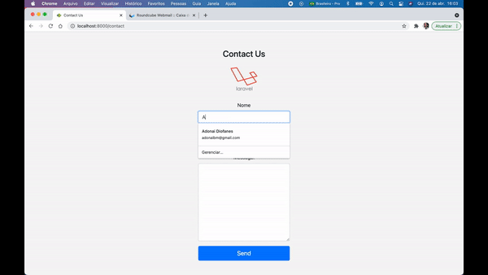

# SMTP MAILER SENDER PROJECT

Um simples projeto escrito em Laravel 5.8 com o intuito de demonstração do funcionamento de disparo de emails de forma customizada utilizando uma view específica para um formulário de Fale Conosco.

O exemplo utilizado foi o disparo de um email através do formulário de contato, enviando os campos: `name`, `email`, `message`

## Requisitos:
1. Laravel 5.8
2. Servidor de SMTP